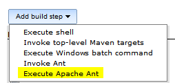
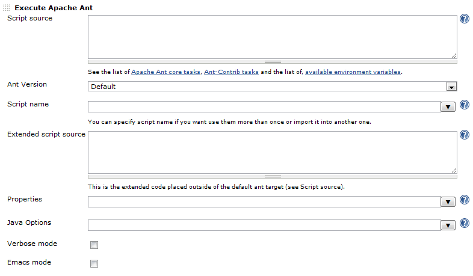
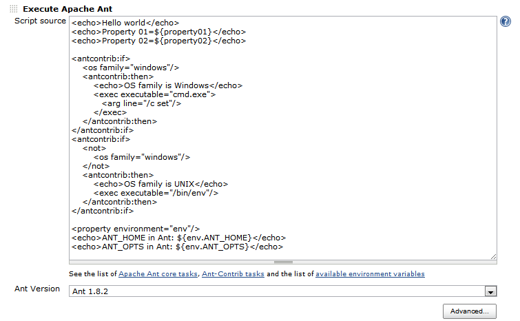

# Jenkins AntExec Plugin

This plugin makes it possible to run Apache Ant code directly from build steps  of your Jenkins-CI.

## Features
- Adding build step to execute Ant code
- Bundled ant-contrib to support ant-contrib tasks (needs to be enable in global config)
- Easy to write simple Ant build file directly into the build step
- Ability to write the fully functional Ant build file directly into Jenkins as a build step
- You can reuse the build file created by the build step
- Supports multi-line parameters

## Some use cases
- To do some platform independent tasks
- To do some advanced build preparation steps
- To write the custom Ant build file maintained by Jenkins
- To maintain custom Ant build file when you don't have access into the VCS of the current project
- To write Ant targets that use multi-line text parameters (currently not possible using the core Ant plugin)
- And much more (wink)

## Support for multi-line text parameters
If your job uses text parameters (as opposed to string parameters) and the parameter values contain newline characters, the core ant plugin fails with the following syntax error:

```
Building in workspace c:\svn\automation\baf
baf $ cmd.exe /C '"ant.bat "-Dmulti_line_text=This is line 1
This is line 2
This is line3" usage && exit %%ERRORLEVEL%%"'
The syntax of the command is incorrect.
Build step 'Invoke Ant' marked build as failure
Finished: FAILURE
```

The problem is that parameters are passed verbatim to the command line, and if they contain any line breaks, cmd.exe will discard everything after the first line break, inevitably leading to a syntax error. The AntExec plugin gets around this problem by saving the build parameters into a .properties file on the fly and loading this file into the Ant session automatically. This also means that you can no longer verify in the build log the list of parameters that were handed down to Ant. If you need this (presumably for debugging purposes) then check the Keep buildfile check box, which will cause the plugin to retain the build file, as well as the parameter properties file, in the workspace of the plugin.

## Usage Screenshots

### Adding new build step


### New AntExec build step


### New AntExec build step with 1st level of advanced options


### New AntExec build step with 2nd level of advanced options


### Code Example


### Code Validation Example


For release history, please see [changelog](CHANGELOG.md).